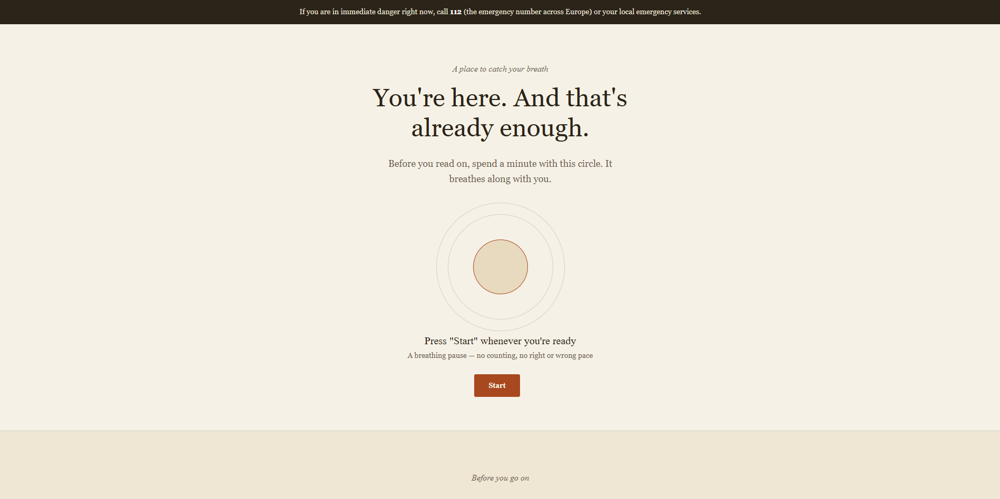
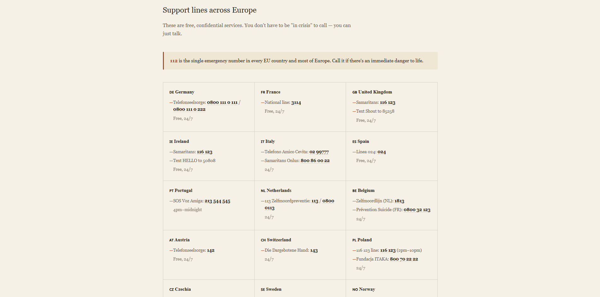
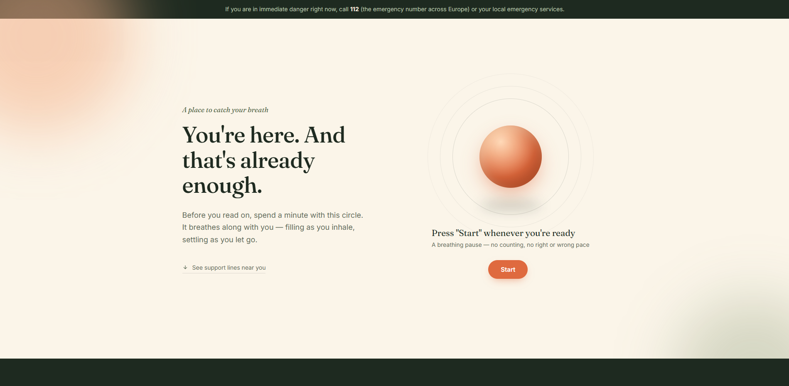
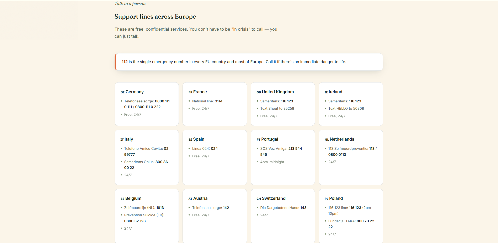

# You Are Not Alone

## A single-page support site: a guided breathing exercise, a short reminder that you're not alone, crisis lines for major European countries, and a few closing thoughts on the value of life. 
P.S - This work means a lot to me

A single-page support site: a guided breathing exercise, a short reminder that you're not alone, crisis lines for major European countries, and a few closing thoughts on the value of life.

🔗 **Live site:** https://abewazaa-del.github.io/SuicideAwareness.github.io/

## Why this project matters

This project means a lot to me. It's also part of how I've been teaching myself to work with code — the site was built with AI assistance for roughly half of the work, while I did the rest myself as practice. I wanted to be upfront about that instead of pretending otherwise.

## What's on the page

- **Breathing exercise** — an animated circle that guides inhale / hold / exhale, with a running count of completed cycles
- **A supportive message** — a short reminder that the visitor isn't alone and their feelings are valid
- **Crisis lines by country** — free, confidential helplines for ~19 European countries, plus 112 and a fallback for countries not listed
- **Closing quotes** — short reflections on the value of life

## Screenshots

<!--
Replace the placeholders below with your own screenshots:
1. Open the live site (or the version you're documenting).
2. Take a screenshot of each section (Windows: Win+Shift+S, Mac: Cmd+Shift+4).
3. Save the images into a folder named `screenshots/` in this repo, in a subfolder per version
   (e.g. screenshots/v1/hero.png, screenshots/v2/hero.png, screenshots/v3/hero.png).
4. Update the paths below to match your file names.
-->

### Version 1 — first pass

| Breathing exercise | Support lines |
|---|---|
|  |  |

### Version 2 — editorial redesign

| Breathing exercise | Support lines |
|---|---|
|  |  |

### Version 3 — current Im working with

| Breathing exercise | Support lines |
|---|---|
|  |  |

## Tech

Plain HTML, CSS and JavaScript — no build step, no dependencies. One file, drop it in any static host.

## Running locally

Just open `index.html` (or `index-en.html`) in a browser — no server required.

## A note on the phone numbers

Helpline numbers were collected from official sources and may change over time. If one doesn't connect, try [findahelpline.com](https://findahelpline.com) or [befrienders.org](https://befrienders.org) for an up-to-date listing.
o me, and I really hope that at least one person will be inspired by seeing it.

🔗 **Live site:** https://abewazaa-del.github.io/SuicideAwareness.github.io/

## What's on the page

- **Breathing exercise** — an animated circle that guides inhale / hold / exhale, with a running count of completed cycles
- **A supportive message** — a short reminder that the visitor isn't alone and their feelings are valid
- **Crisis lines by country** — free, confidential helplines for ~19 European countries, plus 112 and a fallback for countries not listed
- **Closing quotes** — short reflections on the value of life

## Tech

Plain HTML, CSS and JavaScript — no build step, no dependencies. One file, drop it in any static host.

## Running locally

Just open `index.html` in a browser — no server required.

## A note on the phone numbers

Helpline numbers were collected from official sources and may change over time. If one doesn't connect, try [findahelpline.com](https://findahelpline.com) or [befrienders.org](https://befrienders.org) for an up-to-date listing.
